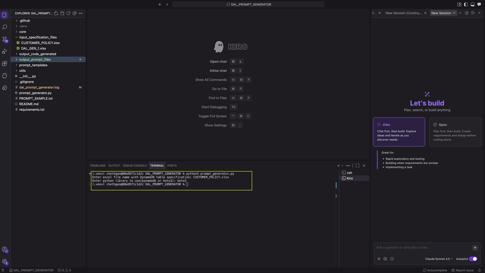
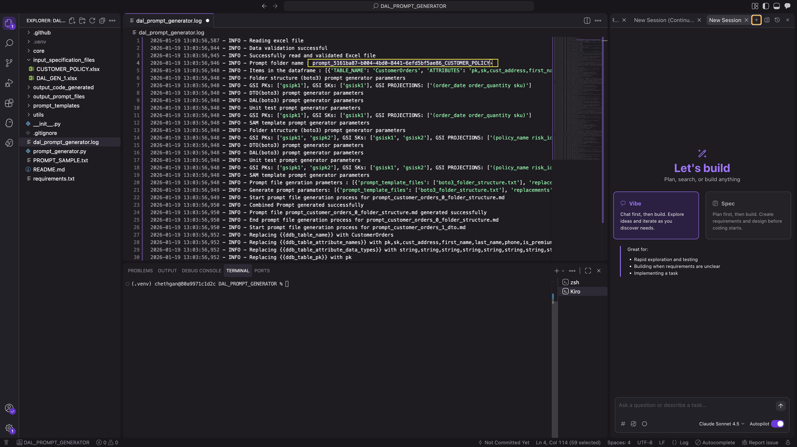
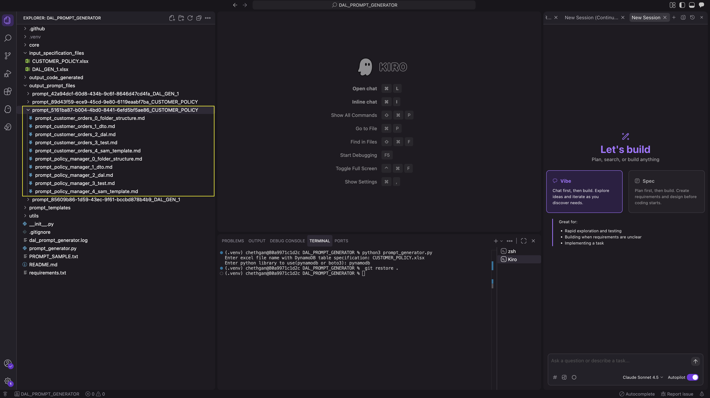
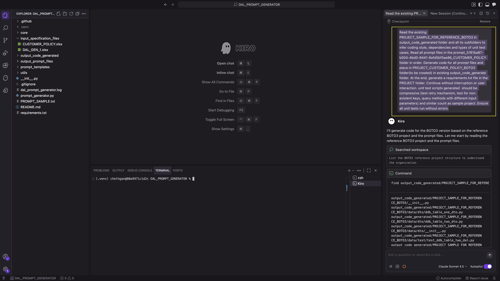
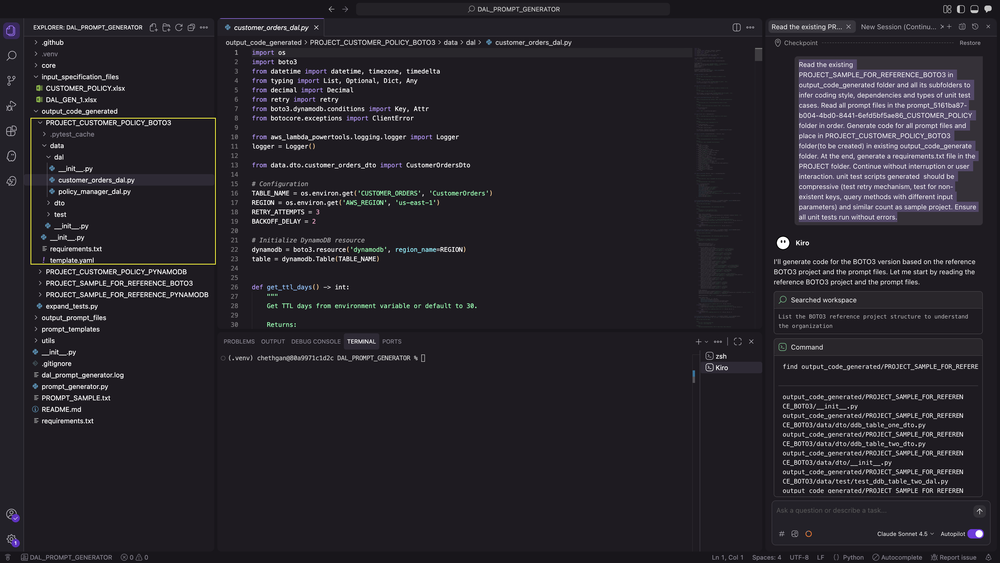
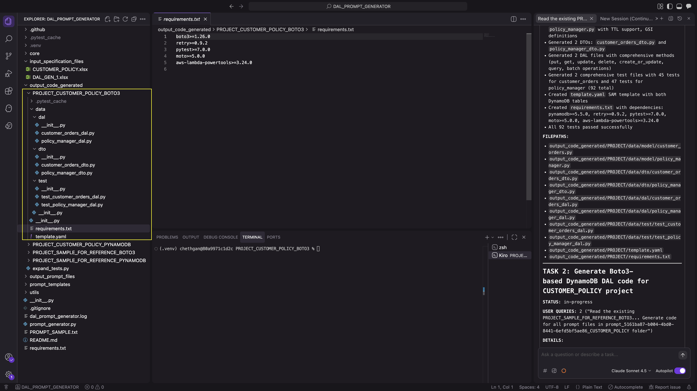
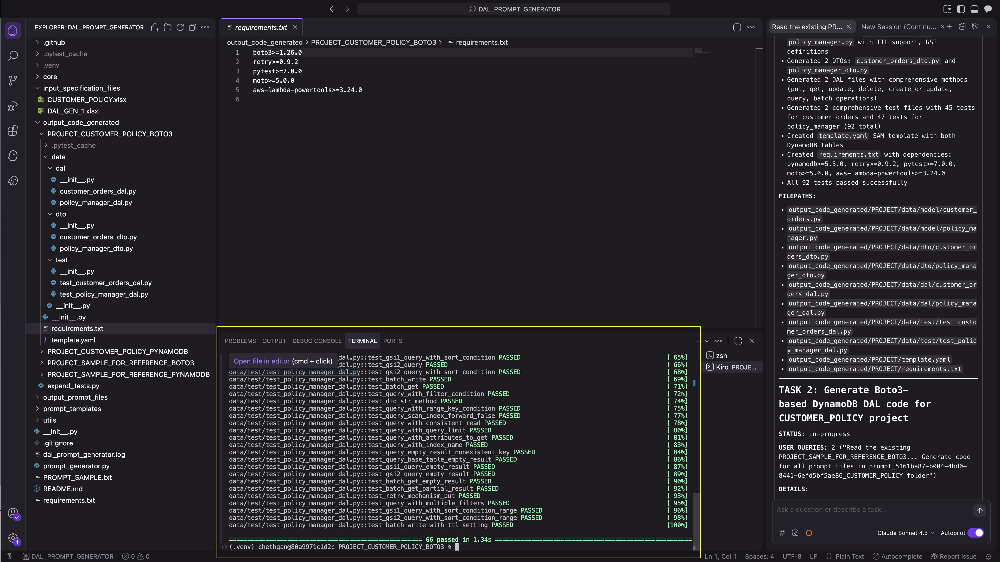
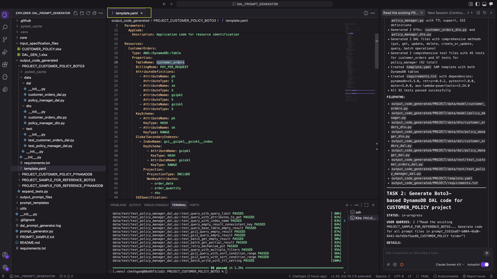

# DAL Prompt Generator

A comprehensive Python-based tool that automates the generation of structured prompts for creating Data Access Layer (DAL) components for AWS DynamoDB tables. This tool reads DynamoDB table specifications from Excel files and generates detailed, AI-ready prompts for creating models, DTOs, DAL methods, unit tests, and SAM templates.

## 🎯 Problem Statement

### The Challenge

Building DynamoDB data access layers consistently across multiple projects and teams presents several critical challenges:

#### 1. **Repetitive Boilerplate Code**
- Writing CRUD operations for each DynamoDB table is time-consuming and error-prone
- Each table requires similar patterns: models, DTOs, DAL methods, and tests
- Developers spend 60-70% of their time writing repetitive data access code
- Copy-paste coding leads to inconsistencies and subtle bugs

#### 2. **Inconsistent Code Patterns**
- Different developers implement DAL differently (retry logic, error handling, logging)
- No standardized approach to pagination, batch operations, or GSI queries
- Inconsistent naming conventions across projects (camelCase vs snake_case)
- Varying levels of test coverage and quality

#### 3. **Knowledge Gaps**
- Junior developers struggle with DynamoDB best practices
- Complex features like GSI projections, TTL, and conditional writes are often misunderstood
- PynamoDB and Boto3 have different patterns and capabilities
- Lack of documentation on production-ready implementations

#### 4. **Manual Error-Prone Process**
- Mismatched attribute counts in table definitions
- Forgotten GSI configurations or incorrect projection types
- Missing audit attributes (created_at, updated_at, TTL)
- Incomplete test coverage for edge cases

#### 5. **AI Code Generation Limitations**
- AI assistants need detailed, structured prompts to generate quality code
- Generic prompts lead to incomplete or incorrect implementations
- Lack of context about project-specific patterns and standards
- Difficulty maintaining consistency across multiple AI-generated components

#### 6. **Time and Cost**
- Manual DAL development takes 2-4 hours per table
- Testing and debugging adds another 1-2 hours
- Multiplied across dozens of tables = significant development cost
- Code reviews require deep DynamoDB expertise

### The Solution

DAL Prompt Generator solves these problems by:

✅ **Automating Prompt Creation**: Transforms Excel specifications into comprehensive, structured prompts  
✅ **Ensuring Consistency**: All generated code follows the same patterns and best practices  
✅ **Reducing Development Time**: From 4 hours per table to 15 minutes  
✅ **Embedding Best Practices**: Built-in retry logic, pagination, error handling, and logging  
✅ **Validating Specifications**: Catches errors before code generation begins  
✅ **Supporting Teams**: Enables junior developers to produce senior-level code  
✅ **Leveraging AI**: Creates AI-ready prompts that generate production-quality code  
✅ **Maintaining Traceability**: Unique batch IDs track all generations  

### Real-World Impact

**Before DAL Prompt Generator:**
```
1. Developer manually writes table specification → 30 mins
2. Creates model class with attributes and GSI → 45 mins
3. Writes DTO class → 15 mins
4. Implements 10+ DAL methods → 90 mins
5. Creates comprehensive tests → 60 mins
6. Code review and fixes → 30 mins
Total: ~4 hours per table
```

**After DAL Prompt Generator:**
```
1. Fill Excel specification → 10 mins
2. Run prompt generator → 30 seconds
3. Feed prompts to AI assistant → 5 mins
4. Review and run tests → 10 mins
Total: ~15 minutes per table
```

**Result: 93% time reduction** with higher quality and consistency.

### Who Benefits

- **Development Teams**: Ship faster with consistent, tested code
- **Junior Developers**: Generate senior-level code with embedded best practices
- **Architects**: Enforce standards across all projects and teams
- **DevOps**: Standardized infrastructure templates (SAM/CloudFormation)
- **Organizations**: Reduce costs, improve quality, scale development

## 🎯 Overview

The DAL Prompt Generator bridges the gap between table specifications and code generation by creating detailed, structured prompts that can be used with AI coding assistants (like GitHub Copilot, ChatGPT, Claude) to generate production-ready DynamoDB data access code.

### Key Benefits

- **Consistency**: Ensures uniform code structure across all tables and projects
- **Speed**: Generates comprehensive prompts in seconds
- **Quality**: Built-in validation ensures data integrity
- **Flexibility**: Supports both PynamoDB and Boto3 libraries
- **Scalability**: Batch processing for multiple tables
- **Traceability**: Unique batch IDs for tracking generations

## ✨ Features

### Core Capabilities

- **Excel-based Configuration**: Define DynamoDB table specifications in user-friendly Excel format
- **Multi-library Support**: Generates prompts for both PynamoDB and Boto3 implementations
- **Comprehensive Prompt Generation**: Creates prompts for:
  - Project folder structure creation
  - PynamoDB models or Boto3 table configurations
  - Data Transfer Objects (DTOs)
  - Data Access Layer (DAL) with full CRUD operations
  - Comprehensive unit test suites
  - AWS SAM CloudFormation templates
- **GSI Support**: Full support for Global Secondary Indexes with custom projections
- **TTL Management**: Built-in Time-To-Live configuration for test and production environments
- **Data Validation**: Comprehensive validation for Excel data integrity
- **Batch Processing**: Process multiple tables with unique batch tracking
- **Detailed Logging**: Complete audit trail with batch ID tracking

### Advanced Features

- **Audit Attributes**: Automatic handling of `created_at`, `updated_at`, `time_to_live`, and `version` attributes
- **Conditional Logic**: Smart handling of optional fields (SK, GSI, TTL, etc.)
- **Test Environment Support**: Special TTL handling for test tenants
- **Error Handling**: Comprehensive exception handling with retry logic
- **Custom Projections**: Support for GSI projection types (KEYS_ONLY, INCLUDE, ALL)

## 📁 Project Structure

```
DAL_PROMPT_GENERATOR/
├── .github/
│   └── copilot-instructions.md        # GitHub Copilot configuration
│
├── .kiro/
│   └── steering/                      # Kiro steering configuration
│
├── kiro-instructions.md               # Kiro instructions/configuration
│
├── input_specification_files/          # Excel-based input specifications
│   ├── DAL_GEN_1.xlsx
│   ├── DAL_GEN_2.xlsx
│   └── CUSTOMER_POLICY.xlsx
│
├── output_prompt_files/                # Generated prompt batches
│   ├── prompt_[uuid]_[filename]/
│   │   ├── prompt_[table]_0_folder_structure.md
│   │   ├── prompt_[table]_1_model.md
│   │   ├── prompt_[table]_2_dto.md
│   │   ├── prompt_[table]_3_dal.md
│   │   ├── prompt_[table]_4_test.md
│   │   └── prompt_[table]_5_sam_template.md
│   └── ...
│
├── output_code_generated/               # AI-generated code projects
│   ├── PROJECT_[uuid]_[filename]/
│   │   ├── data/
│   │   │   ├── model/
│   │   │   ├── dto/
│   │   │   ├── dal/
│   │   │   └── test/
│   │   ├── template.yaml
│   │   └── requirements.txt
│   └── ...
│
├── prompt_templates/                    # Prompt template definitions
│   ├── boto3_dal.txt
│   ├── boto3_folder_structure.txt
│   ├── boto3_table_info.txt
│   ├── dto.txt
│   ├── pynamodb_dal.txt
│   ├── pynamodb_folder_structure.txt
│   ├── pynamodb_model.txt
│   ├── sam_template.txt
│   ├── sam_template_gsi.txt
│   ├── table_gsi.txt
│   └── unit_test.txt
│
├── utils/                               # Utility modules
│   ├── prompt_generator_excel_utils.py
│   ├── prompt_generator_param_utils.py
│   ├── prompt_generator_text_replacer_utils.py
│   └── prompt_generator_utils.py
│
├── prompt_generator.py                  # Main entry point
├── requirements.txt                     # Python dependencies
├── dal_prompt_generator.log             # Generated execution log
└── README_new.md                        # Project documentation

```

## 🚀 Installation

### Prerequisites

- Python 3.9 or higher
- pip package manager
- Virtual environment tool (venv)

### Setup Steps

1. **Clone the repository:**
```bash
git clone <repository-url>
cd DAL_PROMPT_GENERATOR
```

2. **Create and activate virtual environment:**
```bash
# Create virtual environment
python3 -m venv .venv

# Activate on Linux/MacOS
source .venv/bin/activate

# Activate on Windows
.venv\Scripts\activate
```

3. **Install dependencies:**
```bash
pip install -r requirements.txt
```

4. **Verify installation:**
```bash
python3 -c "import pandas; print('Installation successful!')"
```

## 💻 Usage

### Quick Start

1. **Prepare your Excel specification file** in the `input_specification_files/` directory

2. **Run the generator:**
```bash
python3 prompt_generator.py
```

3. **Provide inputs when prompted:**
```
Enter excel file name with DynamoDB table specification: CUSTOMER_POLICY.xlsx
Enter python library to use(pynamodb or boto3): pynamodb
```

4. **Find generated prompts** in `output_prompt_files/prompt_[uuid]_[filename]/`

### Excel File Format

Your Excel file must contain the following columns:

#### Required Columns

| Column | Description | Example |
|--------|-------------|---------|
| **TABLE_NAME** | DynamoDB table name (CamelCase) | `CustomerPolicyTable` |
| **TABLE_PK** | Partition key attribute name | `pk` |
| **ATTRIBUTES** | Comma-separated attribute names | `pk,created_at,customer_id,policy_id` |
| **ATTRIBUTE_DATA_TYPES** | Comma-separated data types | `string,string,string,string` |
| **ATTRIBUTE_DEFAULT_NULL** | Comma-separated null settings | `False,True,False,False` |

#### Optional Columns

| Column | Description | Example |
|--------|-------------|---------|
| **TABLE_SK** | Sort key attribute name | `created_at` |
| **CREATED_AT_REQUIRED** | Include created_at attribute | `Yes` or `No` |
| **UPDATED_AT_REQUIRED** | Include updated_at attribute | `Yes` or `No` |
| **TIME_TO_LIVE_REQUIRED** | Include TTL attribute | `Yes` or `No` |
| **GSI_PKs** | Comma-separated GSI partition keys | `customer_id,policy_id` |
| **GSI_SKs** | Comma-separated GSI sort keys | `address,phone` |
| **GSI_PROJECTIONs** | Comma-separated projection configs | `filename extension status,ALL` |


## 📝 Generated Output Structure

### For PynamoDB Library

The tool generates 6 numbered prompt files per table:

```
output_prompt_files/prompt_[uuid]_[excel_name]/
├── prompt_file_meta_data_table_0_folder_structure.md
├── prompt_file_meta_data_table_1_model.md
├── prompt_file_meta_data_table_2_dto.md
├── prompt_file_meta_data_table_3_dal.md
├── prompt_file_meta_data_table_4_test.md
└── prompt_file_meta_data_table_5_sam_template.md
```

### For Boto3 Library

The tool generates 5 numbered prompt files per table:

```
output_prompt_files/prompt_[uuid]_[excel_name]/
├── prompt_file_meta_data_table_0_folder_structure.md
├── prompt_file_meta_data_table_1_dto.md
├── prompt_file_meta_data_table_2_dal.md
├── prompt_file_meta_data_table_3_test.md
└── prompt_file_meta_data_table_4_sam_template.md
```

### Prompt File Contents

Each prompt file contains:

1. **Folder Structure (0)**: 
   - Directory hierarchy instructions
   - __init__.py file placements
   - Folder organization guidelines

2. **Model/Table Info (1)**:
   - PynamoDB: Model class with attributes, GSI, TTL logic
   - Boto3: Table schema and configuration details

3. **DTO (2)**:
   - Data Transfer Object class definition
   - Attribute mapping (excluding system attributes)
   - JSON serialization methods

4. **DAL (3)**:
   - Complete CRUD operations
   - Query methods with pagination support
   - Batch operations (read/write)
   - GSI query methods
   - Error handling with retry logic
   - Comprehensive logging

5. **Test (4)**:
   - Unit test class with moto mocking
   - Tests for all DAL methods
   - Edge case coverage
   - Pagination testing
   - GSI query testing

6. **SAM Template (5)**:
   - CloudFormation template
   - Table definition with keys
   - GSI configurations
   - TTL settings
   - Billing mode and encryption

## 🏗️ Key Components

### 1. ExcelToDateframe Class
**File**: `utils/prompt_generator_excel_utils.py`

**Purpose**: Excel file processing and validation

**Features**:
- Reads Excel files with pandas
- Validates required columns presence
- Ensures data consistency (attribute counts match)
- Generates unique batch IDs (UUID4)
- Checks for duplicate table names
- Comprehensive error reporting

**Methods**:
- `read_from_excel()`: Main entry point, returns DataFrame and batch_id
- `validate_dataframe()`: Validates all data integrity rules
- `convert_nan_to_string()`: Handles NaN values in data

### 2. PromptGeneratorParam Class
**File**: `utils/prompt_generator_param_utils.py`

**Purpose**: Parameter generation for template substitution

**Features**:
- Maps Excel data to template variables
- Handles conditional logic (SK, GSI, TTL, etc.)
- Library-specific parameter generation
- GSI loop handling for multiple indexes
- Smart attribute inclusion logic

**Key Methods**:
- `get_pynamodb_model_params()`: PynamoDB model parameters
- `get_dto_parmas()`: DTO generation parameters
- `get_pynamodb_dal_params()`: DAL method parameters
- `get_unit_test_params()`: Test file parameters
- `get_sam_template_params()`: SAM template parameters
- `get_boto3_*_params()`: Boto3-specific methods

### 3. PromptGenerator Class
**File**: `utils/prompt_generator_utils.py`

**Purpose**: Prompt file generation and file I/O

**Features**:
- Reads multiple template files
- Combines templates with replacements
- Writes to output directory
- Creates folder structure
- Handles file naming conventions

**Methods**:
- `process_and_generate_prompt_file()`: Main processing method
- `read_template_files()`: Reads and caches templates
- `replace_text()`: Performs substitutions
- `write_prompt_file()`: Writes final output

### 4. TextReplacer Class
**File**: `utils/prompt_generator_text_replacer_utils.py`

**Purpose**: Template variable substitution

**Features**:
- Replaces {{variable}} placeholders
- Handles multiple replacement passes
- Maintains template structure
- Supports conditional replacements
- String manipulation utilities

**Methods**:
- `replace_text()`: Main replacement engine
- `cammel_to_snake()`: CamelCase to snake_case conversion

## 🔍 Validation Features

The tool includes comprehensive validation:

### Table-Level Validation
- ✅ **Unique Table Names**: No duplicate table definitions allowed
- ✅ **Required Columns**: Validates presence of mandatory columns
- ✅ **Valid Library**: Ensures library is 'pynamodb' or 'boto3'

### Data-Level Validation
- ✅ **Attribute Count Consistency**: Ensures ATTRIBUTES, ATTRIBUTE_DATA_TYPES, and ATTRIBUTE_DEFAULT_NULL have same count
- ✅ **GSI Consistency**: Validates GSI_PKs, GSI_SKs, and GSI_PROJECTIONs alignment
- ✅ **Data Types**: Validates supported data types (string, number, boolean, etc.)
- ✅ **Format Validation**: Ensures proper comma-separated values

### Exception Types
```python
class TableNameDuplicateException(Exception): pass
class RequiredColumnMissingException(Exception): pass
class AttributeCountMismatchException(Exception): pass
class InvalidLibraryException(Exception): pass
```

## 📊 Example Workflow

### Step 1: Create Excel Specification
```
input_specification_files/My_Tables.xlsx
```

### Step 2: Run Generator
```bash
$ python3 prompt_generator.py
Enter excel file name: My_Tables.xlsx
Enter python library: pynamodb
```

### Step 3: Review Generated Prompts
```
output_prompt_files/prompt_abc123_My_Tables/
  ├── prompt_user_table_0_folder_structure.md
  ├── prompt_user_table_1_model.md
  ├── prompt_user_table_2_dto.md
  ├── prompt_user_table_3_dal.md
  ├── prompt_user_table_4_test.md
  └── prompt_user_table_5_sam_template.md
```

### Step 4: Use Prompts with AI
1. Open prompt files in order (0 → 5)
2. Feed each prompt to your AI coding assistant
3. Review and validate generated code
4. Run tests to ensure quality

### Step 5: Organize Generated Code
```
output_code_generated/PROJECT_abc123_My_Tables/
  ├── data/
  │   ├── model/
  │   │   └── user_table.py
  │   ├── dto/
  │   │   └── user_table_dto.py
  │   ├── dal/
  │   │   └── user_table_dal.py
  │   └── test/
  │       └── test_user_table_dal.py
  ├── template.yaml
  └── requirements.txt
```

## 🛠️ Advanced Usage

### Custom Template Modification

Templates are located in `prompt_templates/`. You can customize them to match your organization's standards:

```bash
# Edit template
nano prompt_templates/pynamodb_model.txt

# Variables available:
# {{ddb_table_name}}
# {{ddb_table_pk}}
# {{ddb_table_sk}}
# {{ddb_table_attribute_names}}
# ... and more
```

### Batch Processing Multiple Tables

Create Excel file with multiple table rows and run once:

```excel
TABLE_NAME | TABLE_PK | ...
UserTable  | user_id  | ...
OrderTable | order_id | ...
ProductTable | product_id | ...
```

All prompts will be generated in a single batch with unique tracking ID.

### Environment Configuration

Set environment variables for table names:

```python
# In generated code
table_name = os.environ.get('USER_TABLE', 'UserTable')
region = os.environ.get('AWS_REGION', 'us-east-1')
```

### TTL Configuration

Generated code includes TTL methods:

```python
# Environment variables used
USER_TABLE_TTL_DAYS = 30  # Production TTL
USER_TABLE_TEST_TTL_DAYS = 7  # Test environment TTL
```

## 📦 Dependencies

### Core Dependencies
```
pandas>=2.0.3          # Excel file processing
openpyxl>=3.1.2        # Excel file format support
```

### Testing Dependencies
```
pytest>=8.2.1          # Testing framework
moto>=5.1.8            # AWS service mocking
pytest-mock>=3.11.1    # Additional mocking utilities
```

### Runtime Dependencies (Generated Code)
```
pynamodb>=5.5.0        # PynamoDB ORM (if selected)
boto3>=1.28.0          # AWS SDK (if boto3 selected)
retry>=0.9.2           # Retry logic decorator
```

## 🔒 Best Practices

### Excel Specifications
1. ✅ Use clear, descriptive table names in CamelCase
2. ✅ Document attribute purposes in comments
3. ✅ Keep attribute names consistent across tables
4. ✅ Use snake_case for attribute names
5. ✅ Test specifications with small tables first

### Prompt Usage
1. ✅ Follow prompt order (0 → 5)
2. ✅ Review each generated file before proceeding
3. ✅ Run tests after each DAL generation
4. ✅ Validate SAM template before deployment
5. ✅ Keep prompts for documentation

### Code Generation
1. ✅ Use AI assistants that support long context
2. ✅ Review generated code for logic errors
3. ✅ Run linters (flake8, pylint) on generated code
4. ✅ Execute all unit tests before deployment
5. ✅ Add custom business logic after generation

### Version Control
1. ✅ Commit Excel specifications
2. ✅ Version generated prompts
3. ✅ Tag generated code with batch ID
4. ✅ Document customizations
5. ✅ Track template modifications

## 🐛 Troubleshooting

### Common Issues

**Issue**: Excel file not found
```
Solution: Ensure file is in input_specification_files/ directory
Command: ls input_specification_files/
```

**Issue**: Attribute count mismatch
```
Solution: Verify ATTRIBUTES, ATTRIBUTE_DATA_TYPES, and ATTRIBUTE_DEFAULT_NULL 
have same number of comma-separated values
```

**Issue**: Invalid library name
```
Solution: Use exactly 'pynamodb' or 'boto3' (lowercase)
```

**Issue**: GSI projection format error
```
Solution: Use format: "attr1 attr2 attr3" or "ALL" or leave empty
No commas in projection list!
```

### Debug Mode

Enable detailed logging:
```python
# In prompt_generator.py
logging.basicConfig(level=logging.DEBUG)
```

View generated log:
```bash
cat dal_prompt_generator.log
```

## 📈 Performance

- **Excel Processing**: < 1 second for 10 tables
- **Prompt Generation**: < 2 seconds for 6 prompts per table
- **Memory Usage**: < 100MB for typical Excel files
- **Batch Processing**: Scales linearly with table count

## 🤝 Contributing

### Development Setup

1. Fork the repository
2. Create feature branch: `git checkout -b feature/my-feature`
3. Make changes with tests
4. Run validation: `pytest tests/`
5. Commit: `git commit -m "Add my feature"`
6. Push: `git push origin feature/my-feature`
7. Create Pull Request

### Code Style

- Follow PEP 8 guidelines
- Use type hints where applicable
- Add docstrings to all functions
- Include inline comments for complex logic
- Write unit tests for new features

### Testing

```bash
# Run all tests
pytest

# Run with coverage
pytest --cov=utils --cov-report=html

# Run specific test file
pytest tests/test_excel_utils.py
```

## 📄 License

This project is licensed under the MIT License - see the LICENSE file for details.

## 🙏 Acknowledgments

- Built with support from GitHub Copilot
- Uses PynamoDB for DynamoDB ORM
- Powered by pandas for Excel processing
- Testing with moto AWS mocking

## 📞 Support

### Documentation
- Review this README
- Check sample Excel files in `input_specification_files/`
- Examine generated prompts in `output_prompt_files/`
- Study template files in `prompt_templates/`

### Getting Help
1. Check existing issues on GitHub
2. Review log file: `dal_prompt_generator.log`
3. Validate Excel format against examples
4. Create detailed issue with:
   - Excel file content (sanitized)
   - Full error message
   - Log file excerpt
   - Steps to reproduce

## 📊 Statistics

- **Total Templates**: 12
- **Supported Libraries**: 2 (PynamoDB, Boto3)
- **Prompt Files Per Table**: 5-6
- **Lines of Generated Prompts**: 500-1000 per table
- **Validation Rules**: 10+
- **Supported DynamoDB Features**: 90%+

## 🎓 Learning Resources

### DynamoDB
- [AWS DynamoDB Documentation](https://docs.aws.amazon.com/dynamodb/)
- [Best Practices for DynamoDB](https://docs.aws.amazon.com/amazondynamodb/latest/developerguide/best-practices.html)

### PynamoDB
- [PynamoDB Documentation](https://pynamodb.readthedocs.io/)
- [PynamoDB GitHub](https://github.com/pynamodb/PynamoDB)

### Boto3
- [Boto3 DynamoDB Documentation](https://boto3.amazonaws.com/v1/documentation/api/latest/reference/services/dynamodb.html)

---

**Version**: 2.0.0  
**Last Updated**: January 8, 2026  
**Maintainer**: DAL Prompt Generator Team  
**Status**: Active Development

For questions or feedback, please open an issue on GitHub.


### Appendix
Steps to Generate Code

1. Generate Prompt Files
Generate prompt files by running prompt_generator.py, providing the DynamoDB table specification Excel file (e.g., CUSTOMER_POLICY.xlsx, DAL_GEN_1.xlsx) and specifying the library to be used (boto3 or pynamodb).



2. View generated prompt folder name
Find the generated prompt folder in log file.



3. View generated Prompt Files in Prompt folder
Generated the prompt files for PynamoDB DAL generation.



4. Code Generation Using LLM
Use the generated prompt files with GitHub Copilot / Amazon Q / Kiro  to generate the required code.

Provide the following prompt to the tool:

“Read the existing PROJECT_SAMPLE_FOR_REFERENCE_BOTO3 in output_code_generated folder and all its subfolders to infer coding style, dependencies and types of unit test cases. Read all prompt files in the prompt_5161ba87-b004-4bd0-8441-6efd5bf5ae86_CUSTOMER_POLICY folder in order. Generate code for all prompt files and place in PROJECT_CUSTOMER_POLICY_BOTO3 folder(to be created) in existing output_code_generate folder. At the end, generate a requirements.txt file in the PROJECT folder. Continue without interruption or user interaction. unit test scripts generated  should be compressive (test retry mechanism, test for non-existent keys, query methods with different input parameters) and similar count as sample project. Ensure all unit tests run without errors."



Code generation in progress



Code generated



Review the generated implementation and iterate on the code until all unit tests pass successfully.



5. Review Generated DynamoDB Infrastructure Code




Commands:

Setup python virtual environment

```
python -m venv .venv
source .venv/bin/activate
pip install -r requirements.txt
```

Generate prompt files

```
python3 ./prompt_generator.py
```

Run unit test after generation of DAL code

```
python -m pytest data/test/ -v
```

Note

1. The code is generated by an LLM and must be thoroughly reviewed and verified by developers before use.
2. Additional prompts can be provided to generate additional DAL methods/removal of existing DAL methods with unit test, additional unit tests for existing DAL methods, if DAL methods needs to be implemented differently.
